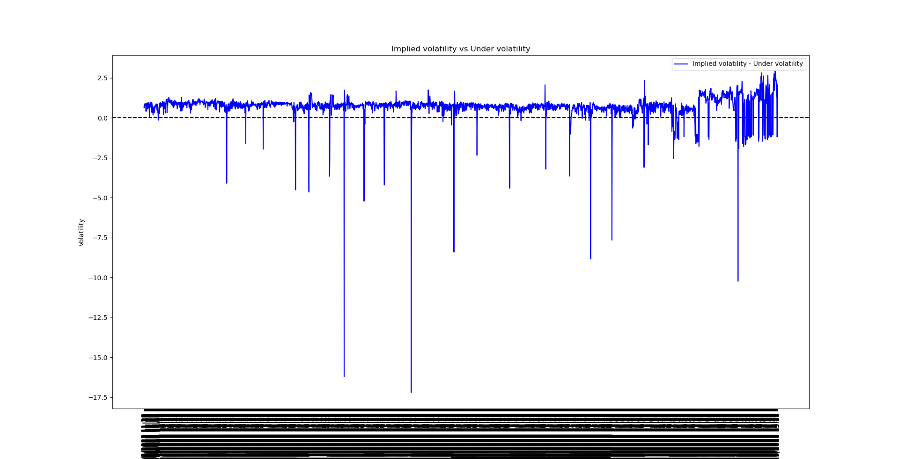
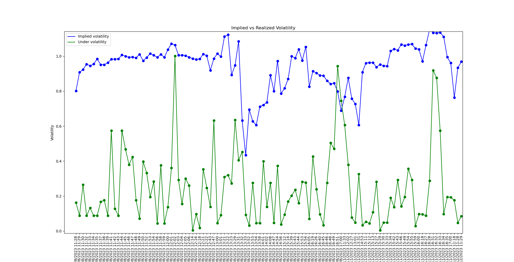

# Introducción

Para el ejercicio se resolvió utilizando C++ (`main.cpp`) y se graficó con Python (`plot_1.py` y `plot_2.py`).

Para el cálculo de la volatilidad implícita, se utilizó el método de bisección.

Se reemplazaron los valores nulos utilizando el promedio entre el valor anterior y el valor siguiente que no sean nulos.

Se anualizó la volatilidad del subyacente multiplicando por la raíz cuadrada de la cantidad de minutos que hay en el año en los que se pueden operar.

Dentro del archivo `Resultados.md` se encuentra una descripción más detallada.

## Gráficos

Si existe la necesidad de ver los gráficos en detalle, se pueden ejecutar los archivos `plot_1.py` y `plot_2.py` respectivamente, gracias a que Matplotlib proporciona un entorno interactivo.

